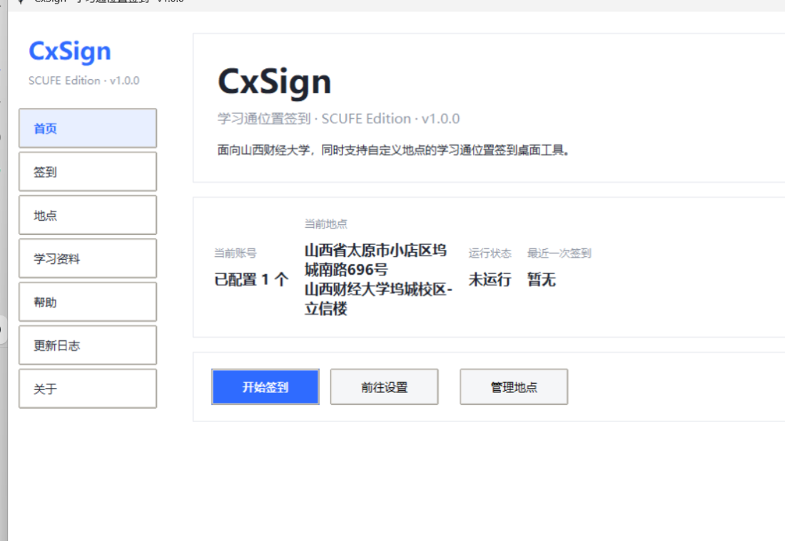
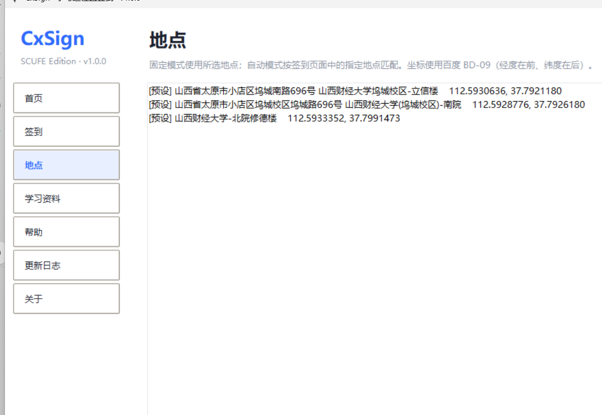
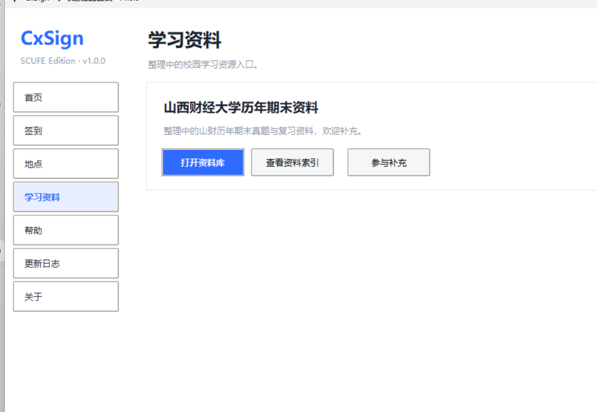
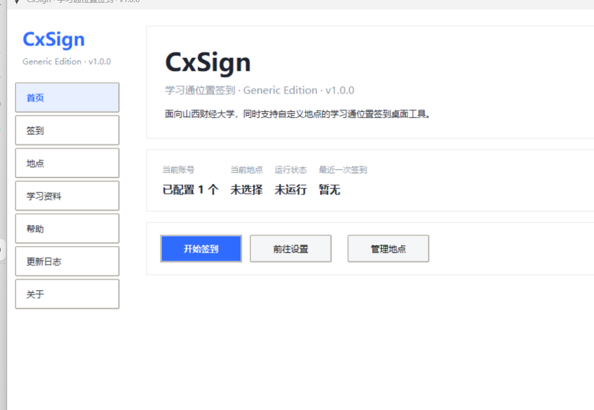

# CxSign

> 一个面向山西财经大学、同时支持其他学校自定义地点的学习通位置签到桌面工具。

CxSign 是一个第三方开源的图形界面签到工具。只需输入课程名、选择账号和地点，即可对进行中的**位置签到**执行一次签到，并逐项反馈结果。

- 🎓 **SCUFE Edition**：内置山西财经大学坞城校区常用地点，开箱即用
- 🌍 **Generic Edition**：不含任何学校预设，任何学校都能自行添加地点
- 📍 **自定义地点**：支持地点的新增、编辑、删除、导入与导出
- 🖥️ **图形化操作**：无需命令行，普通学生也能使用
- 🔒 **本地配置**：账号信息只保存在你自己的电脑上
- 📚 **山财学习资料**：内置山西财经大学历年期末资料入口
- ⭐ **GitHub 开源**：代码、界面、配置体系与文档由本项目维护

## 界面预览

| SCUFE Edition 首页 | 地点管理 |
| --- | --- |
|  |  |

| 学习资料入口 | Generic Edition 首页 |
| --- | --- |
|  |  |

---

## 目录

- [下载](#下载)
- [如何选择版本](#如何选择版本)
- [快速开始](#快速开始)
- [功能](#功能)
- [使用教程](#使用教程)
- [隐私说明](#隐私说明)
- [常见问题](#常见问题)
- [Roadmap](#roadmap)
- [项目结构](#项目结构)
- [贡献](#贡献)
- [接口参考与致谢](#接口参考与致谢)
- [第三方组件](#第三方组件)
- [免责声明](#免责声明)

---

## 下载

> 优先使用 GitHub Releases 下载，源码运行请参考[快速开始](#快速开始)。

| 版本 | 说明 |
| --- | --- |
| `CxSign-v1.0.0-SCUFE.zip` | 山西财经大学版，内置山财地点预设 |
| `CxSign-v1.0.0-Generic.zip` | 通用版，不含任何学校预设 |

### 如何选择版本

- **山西财经大学学生**：推荐 `SCUFE Edition`（内置山财地点，开箱即用）。
- **其他学校学生**：推荐 `Generic Edition`（初始地点为空，自行添加）。

> 即使下载 `SCUFE Edition`，也仍然可以自行添加其他地点。

---

## 快速开始

### 从源码运行

1. 安装 Python 3.9+（Windows 建议 3.9～3.12）。
2. 安装依赖：

   ```bash
   pip install -r requirements.txt
   ```

3. 启动：

   ```bash
   python desktop_ui.py
   ```

   Windows 下也可以双击 `start_windows.vbs` 静默启动（自动优先使用 `.venv`，否则调用系统的 `pythonw`）。

### 首次启动

1. 阅读《用户须知》，点击「我已阅读并理解」进入主程序；
2. 在「签到」页添加账号（手机号登录时学校 ID 留空）；
3. 在「地点」页确认或添加地点；
4. 输入完整课程名，选择账号，点击「查询并签到」。

---

## 功能

- 学习通位置签到（图形界面）
- 固定位置 / 按指定地点匹配两种模式
- 账号管理（本地保存，界面密码遮挡）
- 地点管理（新增、编辑、删除、导入、导出）
- 双版本：SCUFE Edition / Generic Edition
- 首次启动用户须知
- 学习资料入口
- 帮助与更新日志页面

> 本工具仅处理「位置签到」。普通签到、拍照、签到码、二维码、人脸等其他类型会在结果中提示不支持。

---

## 使用教程

- 软件内「帮助」页提供简明说明；
- 完整教程见 [docs/USER_GUIDE.md](docs/USER_GUIDE.md)。

---

## 隐私说明

- **账号信息只保存在本机**：账号、密码、地点、偏好均写入本地文件（`user.json`、`locations.local.json`、`ui.local.json`），这些文件已通过 `.gitignore` 排除，不会进入版本库。
- **不上传至开发者服务器**：本项目没有开发者服务器，不存在上传账号数据的情况。
- **凭据用途**：登录凭据仅用于在本机与学习通平台之间完成必要的请求。
- **无遥测、无统计、无广告**：不包含任何遥测、行为统计、广告或第三方分析 SDK。

详细说明见 [PRIVACY.md](PRIVACY.md)。

---

## 常见问题

**Q：签到失败怎么办？**
先确认网络正常，再核对账号密码、课程名与地点。固定位置若不在签到范围内，服务端仍会判定失败，结果会如实提示。

**Q：支持哪些签到类型？**
目前仅支持位置签到。

**Q：账号安全吗？**
账号保存在你本机的 `user.json`，不会上传。请勿在公共场所保存账号，也勿分享整个项目文件夹。

**Q：会失效吗？**
软件可能因学习通接口、网络环境或平台策略变化而失效，不保证所有环境下可用。

---

## Roadmap

- [ ] 打包为单文件可执行程序（`exe`），进一步降低使用门槛
- [ ] 更多山财校区 / 教学楼地点预设
- [ ] 学习资料在线索引
- [ ] 检查更新（读取 GitHub Releases 最新版本）
- [ ] 多平台支持（macOS / Linux）

> v1.0 不实现刷课、自动答题、人脸绕过、考试相关自动化等功能。

---

## 项目结构

```
CxSign/
├─ desktop_core.py          # 签到核心（登录、课程、活动、地点、签到、结果）
├─ protocol.py              # 学习通平台协议常量（接口地址、请求字段、UA）
├─ paths.py                 # 资源目录与数据目录定位（源码/打包兼容）
├─ desktop_ui.py            # 桌面界面（导航、须知、各页面）
├─ app_config.py            # 品牌信息与 Edition 档案加载
├─ disclaimer.py            # 《用户须知》文案
├─ profiles/
│  ├─ scufe.json            # 山西财经大学版预设地点
│  └─ generic.json          # 通用版（空预设）
├─ docs/
│  ├─ USER_GUIDE.md         # 完整使用教程
│  ├─ PRIVACY.md            # 隐私说明
│  └─ DISCLAIMER.md         # 免责声明
├─ screenshots/             # 界面预览截图
├─ CORE_BEHAVIOR_SPEC.md    # 核心行为规格
├─ config.example.json      # 运行配置模板（edition / dev_mode）
├─ user.example.json        # 账号配置模板
├─ test_desktop.py          # 签到核心回归测试
├─ test_desktop_ui.py       # 界面离线集成测试
├─ CxSign.spec              # PyInstaller 打包规格
├─ build_release.py         # 发行包构建脚本
├─ CHANGELOG.md             # 更新日志
├─ CONTRIBUTING.md          # 贡献指南
├─ SECURITY.md              # 安全说明
├─ LICENSE                  # MIT
├─ THIRD_PARTY_NOTICES.md   # 第三方组件许可证
├─ requirements.txt
└─ start_windows.vbs        # Windows 静默启动器
```

---

## 贡献

欢迎学弟学妹参与维护。报告 Bug、补充地点、建议功能或提交 PR 请参考 [CONTRIBUTING.md](CONTRIBUTING.md)。

- 报告 Bug：请在 Issue 中描述复现步骤与报错信息，**提交前遮挡账号、密码、Cookie 等隐私信息**。
- 补充地点：欢迎为山财或其他学校补充地点预设（仅需地点名称与百度坐标，无需账号）。

---

## 接口参考与致谢

本项目的签到流程在实现过程中参考了社区学习通签到项目（如 `chaoxing_autosign` 系列）对学习通接口的调用方式。当前 CxSign 的核心代码、界面、配置体系与文档均为本项目独立实现，仅保留了实现功能所必需的平台接口信息（接口地址、请求字段、移动端 UA），详见 [CORE_BEHAVIOR_SPEC.md](CORE_BEHAVIOR_SPEC.md) 与 [protocol.py](protocol.py)。

在此向所有分享学习通接口经验的社区开发者致谢。

---

## 第三方组件

本项目使用的第三方 Python 库及其许可证见 [THIRD_PARTY_NOTICES.md](THIRD_PARTY_NOTICES.md)。

---

## 免责声明

本项目为第三方开源学习与技术交流项目，与超星学习通官方、山西财经大学官方均无关联。详细内容见 [DISCLAIMER.md](DISCLAIMER.md) 与软件内《用户须知》。

---

如果这个项目对你有帮助，欢迎点一个 Star ⭐，也欢迎提交 Issue 或参与改进。
